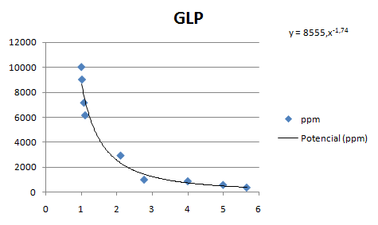
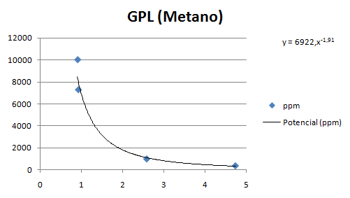
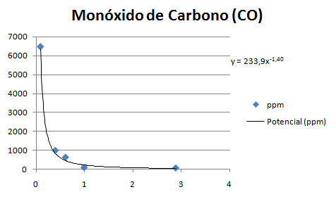

# Cálculos

Estos son los calculos que se utilizan en el sketch para convertir los valores analógicos de los sensores.


### Alcohol


**Puntos de la curva**

Rs/Ro | mg/L
------------ | -------------
0.1333 | 10
0.16666 | 8
0.17 | 6
0.18 | 4
0.19 | 2.5
0.2 | 1.8
0.23 | 1.4
0.6 | 0.9
0.7 | 0.7
0.8 | 0.6
0.9 | 0.5
1 | 0,4
1.66666 | 0.21
1.24 | 0.1

**Ecuación potencial**

- Expresión:
```
y = 0,337x-1,45 
```
- Código:
```arduino
double Alcohol = 0.337*pow(mq3_resistencia/5463, -1.45);
```


### Gases Licuados del Petróleo (GLP)



**Puntos de la curva**

Rs/Ro | ppm
------------ | -------------
0,892 | 10000
0,91 | 8000
0,964 | 6142,85
1 | 5142,85
2 | 1928,57
2,666 | 1000
3 | 778,57
4 | 485,71
4,666 | 271,42


**Ecuación potencial**

- Expresión:
```
y = 6482,x-1,94
```
- Código:
```arduino
double glp = 6482*pow(mq2_resistencia/5463, -1.94);
```


### Metano



**Puntos de la curva**

Rs/Ro | ppm
------------ | -------------
0.35 | 10000
0.48 | 5000
1 | 1000
1.8 | 200


**Ecuación potencial**

- Expresión:
```
y = 876,1x-2,36
```
- Código:
```arduino
double metano = 876,1*pow(mq4_resistencia/5463, -2,36);
```

### Propano

### Monóxido de Carbono



**Puntos de la curva**

Rs/Ro | ppm
------------ | -------------
0,09 | 4000
0,17 | 1000
0,19 | 600
0,28 | 400
0,5 | 200
1,6666 | 40


**Ecuación potencial**

- Expresión:
```
y = 71,78x-1,49 
```
- Código:
```arduino
	double monoxidoDeCarbono = 71.781*pow(mq7_resistencia/5463, -1.49);
```
  

### Hidrógeno

  double hidrogeno = 0.4091*pow(mq8_resistencia/5463, -1.497);

### Dióxido de Carbono

### Óxidos de Nitrógeno

### Amoniaco
