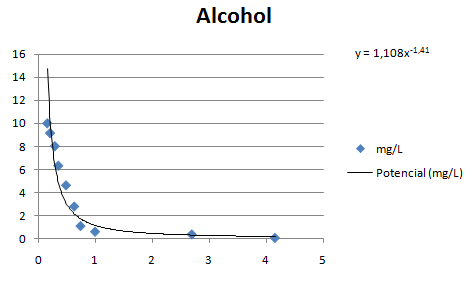

# Cálculos

Estos son los calculos que se utilizan en el sketch para convertir los valores analógicos de los sensores.


### Alcohol



**Puntos de la curva**

Rs/Ro | mg/L
------------ | -------------
0,16 | 10
0,209 | 9,156
0,294 | 8,03
0,355 | 6,343
0,489 | 4,656
0,635 | 2,828
0,744 | 1,14
1 | 0,648
2,7 | 0,416
4,162 | 0,114


**Ecuación potencial**

- Expresión:
```
y = 1,108x-1,41  
```
- Código:
```arduino
double Alcohol = 1,108*pow(mq3_resistencia/5463, -1,41);
```


### Gases Licuados del Petróleo (GLP)


**Puntos de la curva**

Rs/Ro | ppm
------------ | -------------
0,992 | 10000
1,01 | 9000
1,064 | 7142,85
1,1 | 6142,85
2,1 | 2928,57
2,766 | 1000
4 | 878,57
5 | 585,71
5,666 | 371,42


**Ecuación potencial**

- Expresión:
```
y = 8555,x-1,74
```
- Código:
```arduino
double glp = 8555*pow(mq2_resistencia/5463, -1,74);
```


### Metano


**Puntos de la curva**

Rs/Ro | ppm
------------ | -------------
0,898 | 10000
0,915 | 7279,069
2,583 | 1000
4,75 | 379,069


**Ecuación potencial**

- Expresión:
```
y = 6922,x-1,91
```
- Código:
```arduino
double metano = 6922*pow(mq4_resistencia/5463, -1,91);
```

### Propano

### Monóxido de Carbono


**Puntos de la curva**

Rs/Ro | ppm
------------ | -------------
0,09 | 4000
0,17 | 1000
0,19 | 600
0,28 | 400
0,5 | 200
1,6666 | 40


**Ecuación potencial**

- Expresión:
```
y = 71,78x-1,49 
```
- Código:
```arduino
	double monoxidoDeCarbono = 71.781*pow(mq7_resistencia/5463, -1.49);
```
  

### Hidrógeno

  double hidrogeno = 0.4091*pow(mq8_resistencia/5463, -1.497);

### Dióxido de Carbono

### Óxidos de Nitrógeno

### Amoniaco
